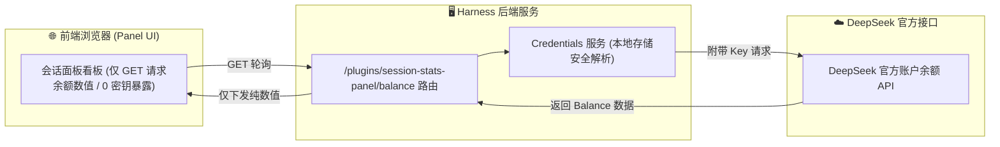

<div align="center">

# 📊 dsh-session-stats-panel
### 💰 DeepSeek Harness 实时会话统计 · 官方峰谷计费 · 账户余额看板插件

[](https://github.com/a1113622001/dsh-session-stats-panel)
[](https://www.npmjs.com/package/dsh-session-stats-panel)
[](https://nodejs.org/)
[](LICENSE)

[English](./README.en.md) · [简体中文](./README.md)

</div>

---

## 📖 项目简介

**dsh-session-stats-panel** 是已上架 **DeepSeek Harness 官方插件市场** 的会话计量与成本监控客户端插件。

无侵入式挂载在页面右侧，实时展示当前会话的 **Token 缓存命中率**、**官方峰谷计费估算**、**DeepSeek 官方账户余额**、**运行时长** 与 **累计 Tokens**，让大模型 Agent 开发的成本与效率一目了然。

---

## 🛒 插件市场与安装方式

### 方式 1：通过 Harness Web 插件市场一键安装（推荐）
1. 打开 DeepSeek Harness Web 界面（默认 `http://127.0.0.1:3080`）；
2. 进入 **`设置 (Settings)`** -> **`插件市场 (Plugin Inventory / Market)`**；
3. 搜索 **`dsh-session-stats-panel`**，点击 **`安装 (Install)`** 即可完成热加载。

### 方式 2：通过 Harness CLI 命令行安装
```bash
# 官方插件名一键添加
dsh plugin add dsh-session-stats-panel

# 或指定 profile 安装
dsh plugin --profile web add dsh-session-stats-panel

# 或直接从 GitHub 安装
dsh plugin add github:a1113622001/dsh-session-stats-panel
```

---

## 📊 监控指标看板

| 核心指标 | 数据源与计算方式 | 业务价值 |
| :--- | :--- | :--- |
| **平均命中率** | `cacheReadTokens / 计费输入 Tokens` | 直观评估 Prompt Caching 优化效果 |
| **会话估算费用** | 按照 DeepSeek 官方峰谷价格表动态计算 | 精确核算单次 Agent 任务运行成本 |
| **剩余账户余额** | 服务端凭据隔离路由拉取（每 2 分钟刷新） | 避免 Key 暴露前端的同时实时监控余额 |
| **累计 Tokens** | 未命中输入 + 缓存读写 + 输出（千分位展示） | 掌握上下文膨胀与消耗规模 |
| **模型请求次数** | 会话中模型调用步骤（`steps`）计数 | 监控 Agent 思考轮数与工具调用频次 |

---

## 🕒 2026 官方最新峰谷定价支持

插件内置 DeepSeek 官方最新峰谷计费规则（按北京时间自动切换）：
- **高峰时段**（周一至周五 09:00–12:00，14:00–18:00）：按标准基准价计费；
- **空闲时段**（其余全部时段，含周六、周日全天）：**价格为高峰时段的一半**；
- **模型覆盖**：原生支持 `deepseek-flash`（DeepSeek-V4.1-Flash）与 `deepseek-v4-pro`（DeepSeek-V4-Pro-0813）；兼容已下线的 `deepseek-v4-flash` / `deepseek-v4-flash-vision-exp`（请求仍由 V4.1-Flash 提供服务，按 Flash 价计费）；带版本后缀的 id（如 `deepseek-v4-pro-0813`）会自动归入所属系列，未知 `deepseek-*` 模型按 Flash 价兜底。

单位：**元 / 百万 tokens**，缓存写入按缓存命中价计费。

| 模型 | 时段 | 缓存命中输入 | 缓存未命中输入 | 输出 |
| :--- | :--- | ---: | ---: | ---: |
| `deepseek-flash` | 空闲 | 0.02 | 1 | 4 |
| `deepseek-flash` | 高峰 | 0.04 | 2 | 8 |
| `deepseek-v4-pro` | 空闲 | 0.15 | 4.5 | 13.5 |
| `deepseek-v4-pro` | 高峰 | 0.30 | 9.0 | 27.0 |

---

## 🔒 服务端凭据隔离安全设计



---

## 📄 开源许可证

本项目采用 [MIT License](LICENSE) 授权开源。
